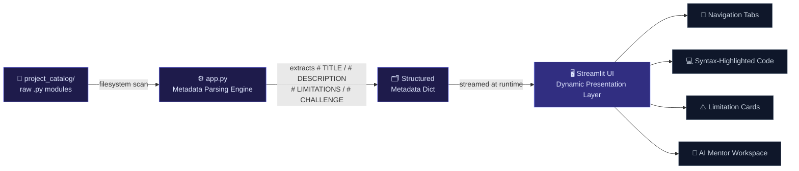

<div align="center">


<a href="https://git.io/typing-svg">
  
</a>

<br/>

[](https://www.python.org/)
[](https://streamlit.io/)
[]()
[]()
[]()

<br/>


[](https://github.com/Kushagra-2112/Python-Practice-Projects/stargazers)
[](https://github.com/Kushagra-2112/Python-Practice-Projects/network/members)
[]()

</div>

<br/>

> **PySource Hub** is a dynamic, file-driven educational platform built to bridge the gap between classroom syntax and professional software engineering. Shifting away from standard *"write-from-scratch"* sandboxes, this repository implements a **"Read-First, Patch-Second"** educational architecture — an active ecosystem where developers audit pre-built pipelines, uncover documented technical debt, and submit production-grade upgrades through an enterprise-style Git-Flow review loop.

<br/>

## 📑 Table of Contents

- [🎯 Key Architectural Metrics](#-key-architectural-metrics)
- [🛠️ System Architecture & How It Works](#️-system-architecture--how-it-works)
- [📂 Project Repository Structure](#-project-repository-structure)
- [🧩 Catalog Index](#-catalog-index)
- [⚡ Quickstart](#-quickstart)
- [🧱 Module Header Spec](#-module-header-spec)
- [🤝 Contributing Workflow](#-contributing-workflow)
- [🗺️ Roadmap](#️-roadmap)
- [➕ Adding a Roadmap Item](#-adding-a-roadmap-item)
- [📄 License](#-license)

<br/>

## 🎯 Key Architectural Metrics

<table width="100%">
<tr>
<td width="33%" align="center">

### 🧮 Scalability
**Horizontal**
<br/>
<sub>File-driven · zero-database overhead</sub>

</td>
<td width="33%" align="center">

### 🧱 Coupling
**Decoupled**
<br/>
<sub>UI layer fully separated from storage (<code>project_catalog/</code>)</sub>

</td>
<td width="33%" align="center">

### 🔍 Discovery
**Runtime**
<br/>
<sub>Zero-config — drop a file in, it appears</sub>

</td>
</tr>
</table>

<br/>

## 🛠️ System Architecture & How It Works

Instead of reaching for a heavyweight database engine (MongoDB, MySQL) that adds infrastructure overhead a learning project doesn't need, PySource Hub runs entirely on an intelligent **decoupled, file-driven Micro-CMS workflow**:



| Layer | Responsibility |
|---|---|
| **Storage** (`project_catalog/`) | Raw, runnable Python script modules, isolated as independent files in a flat registry. |
| **Parsing Engine** (`app.py`) | Lightweight string-parsing reads the filesystem at runtime and extracts key-value attributes straight from source comments — no separate config or database needed. |
| **Presentation Layer** (`app.py` + `welcome.py`) | Streamlit consumes the parsed metadata stream live, generating tabs, syntax-highlighted code views, limitation cards, and a per-project AI mentor chat panel. |

<br/>

## 📂 Project Repository Structure

```text
python-practice-projects/
│
├── app.py                  # Core Controller Engine (Routing & Dynamic UI Generation)
├── welcome.py              # Front-Page Overview, Architecture Hub, & Contribution Guide
├── README.md               # Repository System Manual & Documentation
│
└── project_catalog/        # Storage Directory for Independent Runnable Modules
    ├── project1.py         # Band Name Generator (F-Strings & Input Stripping)
    ├── project2.py         # Dynamic Tip Calculator (Type Conversion & Arithmetic Safety)
    ├── project3.py         # Treasure Island Choice Engine (Control Flow Restructuring)
    ├── project4.py         # Rock Paper Scissors Simulation (Probabilistic Logic Mapping)
    ├── project5.py         # PyPassword Generator Engine (Cryptographic Entropy Optimization)
    ├── project6.py         # Dynamic Hangman Word Game (State Validation Loops)
    ├── project7.py         # Caesar Cipher Encryptor (Positional Rotation Arrays)
    ├── project8.py         # Blind Secret Auction Platform (Dynamic Collections & Tie Handling)
    ├── project9.py         # Procedural Stream Calculator (State Persistence & Try-Except Blocks)
    └── project10.py        # Casino Blackjack Arcade Game (Dynamic Hand Valuation & AI Loops)
```

<br/>

## 🧩 Catalog Index

<div align="center">

| # | Module | Focus Area | Core Concepts |
|:-:|---|---|---|
| 01 | **Band Name Generator** | String composition | F-strings, input stripping |
| 02 | **Dynamic Tip Calculator** | Numeric safety | Type conversion, arithmetic guards |
| 03 | **Treasure Island Choice Engine** | Branching logic | Control flow restructuring |
| 04 | **Rock Paper Scissors Simulation** | Randomized logic | Probabilistic logic mapping |
| 05 | **PyPassword Generator Engine** | Security tooling | Entropy, randomized character sets |
| 06 | **Dynamic Hangman Word Game** | Game-state logic | State validation loops |
| 07 | **Caesar Cipher Encryptor** | Classic cryptography | Positional rotation arrays |
| 08 | **Blind Secret Auction Platform** | Data structures | Dynamic collections, tie handling |
| 09 | **Procedural Stream Calculator** | Resilient I/O | State persistence, try/except |
| 10 | **Casino Blackjack Arcade Game** | Applied game logic | Hand valuation, dealer AI loops |

</div>

> Every module above already runs — that's intentional. The job isn't to write it from scratch; it's to find what's quietly wrong with it and patch it like a real pull request.

<br/>

## ⚡ Quickstart

```bash
# 1. Clone the repository
git clone https://github.com/Kushagra-2112/Python-Practice-Projects.git
cd python-practice-projects

# 2. Install dependencies
pip install streamlit

# 3. Launch the hub
streamlit run app.py
```

The app opens at **`http://localhost:8501`** — land on the **Hub Home Overview** tab, then switch to **Project Workspace Dashboard** to pick a module from the sidebar, read its code, audit its flaws, and chat with the AI Code Mentor panel.

<br/>

## 🧱 Module Header Spec

Every file inside `project_catalog/` is self-describing. The parsing engine reads these four comment keys directly from the top of each script — no separate manifest required:

```python
# TITLE: Band Name Generator
# DESCRIPTION: Combines a city name and a pet name into a randomized band name.
# LIMITATIONS: No input validation on empty strings | Doesn't handle non-ASCII names
# CHALLENGE: Add input sanitization so empty or whitespace-only entries are rejected.

city = input("What's the name of your city? ")
pet = input("What's your pet's name? ")
print(f"Your band name could be {city} {pet}!")
```

| Key | Purpose |
|---|---|
| `# TITLE:` | Display name shown in the sidebar selector and workspace header. |
| `# DESCRIPTION:` | One-line summary rendered under the project title. |
| `# LIMITATIONS:` | Pipe-separated (`\|`) list of known flaws — rendered as warning cards. |
| `# CHALLENGE:` | The fix task presented to the contributor as an open practice prompt. |

To add a new project, drop a file named `project11.py` (or higher) into `project_catalog/` with these four headers — it appears in the sidebar automatically, sorted numerically, no code changes required.

<br/>

## 🤝 Contributing Workflow


1. **Select a Repository** — pick a project from the sidebar index dropdown.
2. **Audit Flaws** — read the documented limitations rendered in the workspace.
3. **Fork & Code** — fork the repo and patch the limitation locally.
4. **Pull Request** — submit your fix. Once merged, your optimized logic replaces the blueprint live for the next learner.

<br/>

## 🗺️ Roadmap

> Tracking where PySource Hub is headed architecturally. Contributions against any open phase below are welcome — see [Contributing Workflow](#-contributing-workflow).

<details open>
<summary><strong>🔍 Phase 1 — Robust Data Validation & Schema Enforcement</strong></summary>
<br/>

- [ ] **Decouple Documentation** — move metadata out of fragile `.py` code comments into matching `projectX.json` configuration files.
- [ ] **Implement Schema Defenses** — validate parsed metadata using safe Python dictionary `.get()` calls so formatting typos can't break the UI.
- [ ] **Graceful Error Fallbacks** — if a metadata file is corrupt or missing, the platform skips it cleanly instead of crashing the workspace view.

</details>

<details open>
<summary><strong>🧠 Phase 2 — State Persistence & Advanced UX Isolation</strong></summary>
<br/>

- [ ] **Isolate Chat Variables** — map each AI Mentor chat history array to a unique project key inside `st.session_state`.
- [ ] **Maintain Multi-Workspace Memory** — persistent caching so a student can swap between project workspaces without losing their active debug conversation with the AI mentor.

</details>

<details open>
<summary><strong>🤖 Phase 3 — CI/CD Pipeline Automation</strong></summary>
<br/>

- [ ] **Architect Automated Testing** — write `pytest` unit test suites for each project sandbox.
- [ ] **Integrate GitHub Actions** — a workflow (`.github/workflows/verify.yml`) that spins up a container automatically on every Pull Request.
- [ ] **Automated Code Stamp** — the cloud runner passes (✓) or fails (×) a contributor's fix before a human ever reviews it.

</details>

<details open>
<summary><strong>📊 Phase 4 — Gamification & Contributor Tracking</strong></summary>
<br/>

- [ ] **Connect to the GitHub REST API** — fetch repository collaboration data directly from GitHub.
- [ ] **Launch the Contributor Wall of Fame** — a leaderboard component on the `welcome.py` home tab showing avatars and usernames of contributors whose patches were merged.

</details>

<br/>

> 💡 **Want to update progress yourself?** Check a box by editing this README directly — change `- [ ]` to `- [x]` for any task you've completed, then open a PR. See [Adding a Roadmap Item](#-adding-a-roadmap-item) below for how to propose new phases or tasks.

<br/>

## ➕ Adding a Roadmap Item

The roadmap above is a living document, not a fixed spec.

- Pick the right phase, or propose a new `Phase N` if it doesn't fit
- Format: `- [ ] **Short Bold Label** — one-line outcome`
- Describe the outcome, not the implementation
- Open an issue first for anything non-trivial
- Check it off in the same PR that ships it

<br/>

## 📄 License

No license has been specified for this repository yet. If you intend to reuse, fork, or build on top of this project, please reach out to the repository owner first.


<br/>

<div align="center">


<sub>Built for developers who'd rather debug a real pipeline than write another todo-list tutorial.</sub>

</div>
